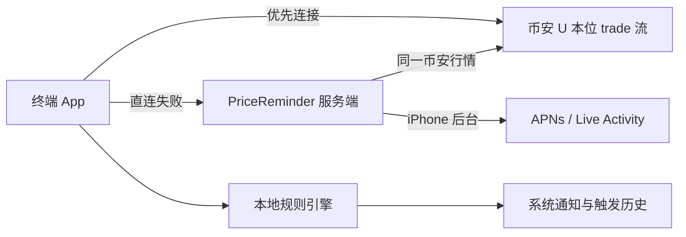

# 币价提醒 PriceReminder

[](https://github.com/Zhu-JunFeng/pricereminder/releases/latest)
[](https://github.com/Zhu-JunFeng/pricereminder/actions/workflows/release.yml)

一个安静、直接的币安 U 本位永续合约价格提醒工具。支持 Android、兼容 Android APK 的华为设备、iPhone、macOS 和 Windows；价格判断和通知尽量在终端本地完成。

当前稳定版本以页面顶部的 Latest Release 徽章为准。

## 下载与安装

前往 [GitHub Releases](https://github.com/Zhu-JunFeng/pricereminder/releases/latest) 下载最新版：

| 平台 | 安装包 | 要求与安装方式 |
| --- | --- | --- |
| Android / 华为 | `PriceReminder-Android-<版本>.apk` | Android 10+；允许浏览器或文件管理器“安装未知应用”后安装。该 APK 不依赖 GMS/HMS，不支持 HarmonyOS NEXT。 |
| macOS | `PriceReminder-macOS-<版本>.dmg` | macOS 14+；打开 DMG，将 App 放入“应用程序”。当前版本未公证，首次启动如被拦截，请在“系统设置 → 隐私与安全性”中确认打开。 |
| Windows | `PriceReminder-Windows-x64-<版本>.zip` | Windows 10/11 x64；解压后运行 `PriceReminder.exe`，无需预装 .NET。当前版本未使用商业代码签名，SmartScreen 可能要求手动确认。 |
| iPhone | 暂无通用安装包 | iOS 17.2+；需使用 Xcode 和开发者账号自行签名。后台 APNs 通知要求加入 Apple Developer Program，Personal Team 不支持 Push Notifications。 |

每个 Release 同时提供 `SHA256SUMS-<version>.txt`。下载后可计算安装包 SHA-256，并与文件中的对应记录比较：

```bash
shasum -a 256 PriceReminder-macOS-<版本>.dmg
```

## 核心功能

- **实时价格：** 使用币安 U 本位永续公开 `<symbol>@trade` WebSocket 的最新成交价，不需要 API Key。
- **涨跌幅提醒：** 监控当前价相对 `N` 分钟前价格的滚动变化，支持 `N=1..60` 分钟、`X=0.1..100%`。
- **目标价格提醒：** 支持“达到或高于”和“达到或低于”两种方向。
- **合约快速选择：** 所有合约选择器均可输入搜索，最近确认选择的三个合约自动置顶但不额外显示分组。
- **提醒编辑：** 已配置提醒可原位编辑类型、合约和全部参数，并安全重新初始化触发状态。
- **自动重新武装：** 目标价进入目标区间时只提醒一次，离开区间后才允许再次提醒；涨跌方向分别维护触发状态。
- **本地系统通知：** Android、华为、macOS 和 Windows 在终端本地判断并通知；关闭通知权限不会停止行情和规则计算。
- **菜单栏与托盘：** macOS 菜单栏、Windows 通知区域最多展示三个自选合约的实时价格；macOS 连续两次上涨或下跌时分别显示绿色上箭头或红色下箭头。
- **iPhone 灵动岛：** App 活跃时，用户可点击“显示实时价格”创建 Live Activity 展示所选合约；系统展示最多每 15 秒更新一次。
- **断线自检：** 展示连接路径、订阅数量、行情延迟、最后接收时间、重连次数、最近错误和通知权限，并支持测试通知。
- **本地历史：** 保存最近 1 小时价格缓冲和最近 30 天触发记录。

## 提醒规则

### N 分钟涨跌幅

以币安事件时间为准，计算：

```text
变化率 = (当前价格 - N 分钟前价格) / N 分钟前价格 × 100%
```

- 上涨和下跌方向独立判断，达到阈值即触发。
- 回到阈值范围内后立即重新武装。
- 如果目标窗口缺少足够接近的基准价格，继续积累数据，不使用不完整数据误报。

### 目标价格

- `达到或高于`：最新成交价首次大于等于目标价时提醒。
- `达到或低于`：最新成交价首次小于等于目标价时提醒。
- 价格留在目标区间内不会重复提醒；离开后自动重新武装。
- 新建或重新启用规则时，如果当前价已经满足条件，会先初始化为已触发，避免下一条行情立即误报。

## 是否需要服务端

大部分功能不依赖服务端。Android、华为、macOS、Windows 和前台运行的 iPhone 都会优先由终端直接连接币安，并在本地保存规则、计算价格和发送通知。

服务端只承担以下能力：

| 能力 | 是否必须使用服务端 |
| --- | --- |
| 终端前台实时价格与本地规则 | 否 |
| Android / macOS / Windows 本地系统通知 | 否 |
| 终端无法直连币安时的同源行情中继 | 是 |
| iPhone 进入后台后的持续规则计算 | 是 |
| iPhone 后台 APNs 通知 | 是 |
| Live Activity 后台远程更新 | 是 |

终端直连失败时会切换到服务端中继，但中继转发的仍是币安官方最新成交价，不会切换到其他交易所或其他价格口径。服务端不可用时，依赖服务端的功能会明确显示不可用，不影响能够直连币安的本地功能。

## 连接与断线行为



- 直连失败或 3 秒内没有有效行情时，终端切换到服务端中继。
- 服务端链路中断后自动重连，并定期重新探测终端直连。
- 中继回放只用于补齐本地价格窗口，不会补发断线期间的历史提醒。
- 价格超过 30 秒未更新时明确标记为陈旧，不继续假装实时。
- 同一秒内同合约多条规则命中时合并为一条系统通知。

## 平台行为

| 平台 | 监控方式 | 系统展示 | 关闭界面后的行为 |
| --- | --- | --- | --- |
| Android / 华为 | 前台服务，本地判断 | 常驻通知 | 返回桌面后继续；强制停止 App 后结束 |
| iPhone | 前台本地判断，后台服务端接管 | App、Live Activity、灵动岛 | 后台提醒依赖服务端与 APNs |
| macOS | 菜单栏应用，本地判断 | 菜单栏最多三个合约 | 退出应用后停止 |
| Windows | 托盘应用，本地判断 | 通知区域最多三个合约 | 关闭窗口继续，托盘选择“退出”后停止 |

打开应用后会默认开始监控。Windows 如在设置中启用“开机启动”，用户登录后会以托盘模式启动并开始监控；Android 重启后需要再次打开应用，macOS 和 iPhone 未实现登录启动。

## 技术栈

| 模块 | 技术 |
| --- | --- |
| 共享规则语义 | Swift、Kotlin、C#、Go 分平台实现；各端核心检查覆盖阈值、重新武装、数据窗口与目标价格 |
| iOS / macOS | SwiftUI、ActivityKit、UserNotifications |
| Android / 华为 | Kotlin、Jetpack Compose、Foreground Service、OkHttp |
| Windows | .NET 8、WinForms、NotifyIcon |
| 服务端 | Go、PostgreSQL、WebSocket、APNs HTTP/2 |

## 工程结构

```text
server/             Go 行情中继、iOS 后台规则与 APNs
apple/              iOS、Live Activity、macOS 菜单栏与共享 Swift 核心
android/            Android / 华为通用 APK、Compose 与前台服务
windows/            Windows 10/11 原生托盘程序
shared/fixtures/    跨端规则一致性样例
docs/               架构、协议与本地开发说明
```

## 本地开发与验证

详细环境变量、服务端配置和端到端验证方式见 [`docs/local-development.md`](docs/local-development.md)。架构与断线语义见 [`docs/architecture.md`](docs/architecture.md)，接口协议见 [`docs/protocol.md`](docs/protocol.md)。

### Go 服务端与规则

需要 Go 1.24+：

```bash
cd server
go test ./...
go run ./cmd/pricereminder
```

服务端是可选组件，但启用行情中继和 iPhone 后台能力时需要 PostgreSQL；启用 iPhone 后台通知还需要 APNs 凭据。

### Apple

需要 Xcode；工程目标为 iOS 17.2+、macOS 14+：

```bash
cd apple/PriceCore
swift run PriceCoreCheck

cd ..
xcodebuild -project PriceReminder.xcodeproj -scheme PriceReminderMac -configuration Debug build
xcodebuild -project PriceReminder.xcodeproj -scheme PriceReminderiOS \
  -destination 'generic/platform=iOS Simulator' CODE_SIGNING_ALLOWED=NO build
```

### Android

需要 JDK 17 和 Android SDK：

```bash
cd android
./gradlew :rule-core:test testDebugUnitTest assembleDebug assembleRelease
```

### Windows

需要 .NET 8 SDK；GitHub Actions 也会在真实 Windows 环境执行相同核心检查和构建：

```powershell
dotnet run --project windows/PriceReminder.CoreChecks/PriceReminder.CoreChecks.csproj --configuration Release
dotnet build windows/PriceReminder.Windows.csproj --configuration Release
dotnet publish windows/PriceReminder.Windows.csproj --configuration Release --runtime win-x64 --self-contained true
```

## 数据与隐私

- 币安公开行情不需要填写交易所 API Key，本项目不执行下单或资产操作。
- 规则、价格缓冲和触发历史默认保存在终端本地。
- iPhone 后台监控启用时，已配置规则、匿名设备标识、推送 Token 和必要状态会同步到 PriceReminder 服务端。
- 服务端不需要交易所账户凭据；APNs 私钥只应通过服务器环境变量配置，不能提交到仓库。

## 当前限制

- 只支持币安 U 本位永续合约的最新成交价，不包含现货、交割合约、标记价格、K 线或其他交易所。
- Android Release 尚未配置公开发行签名，GitHub 当前提供的是可直接安装的 Debug 签名 APK。
- macOS 安装包尚未 Apple 公证，Windows 可执行文件尚未商业代码签名。
- iPhone 后台提醒依赖公网 HTTPS 服务端、PostgreSQL、有效 APNs 配置和付费 Apple Developer Program。
- HarmonyOS NEXT 不能运行 Android APK，当前没有 HarmonyOS NEXT 原生版本。
- CI 验证规则核心和各平台构建，不替代真实设备上的通知权限、断线重连、价格越线提醒、iPhone APNs 与后台 Live Activity 验收。

## 版本发布

每次推送 `main` 后，GitHub Actions 会串行选择下一个补丁版本，并在 Linux、macOS、Windows 环境完成服务端测试、三端规则检查、Android APK、macOS DMG、Windows 自包含包和 iPhone 模拟器构建。只有全部成功才会创建新标签与 [GitHub Release](https://github.com/Zhu-JunFeng/pricereminder/releases)，并上传三个桌面/移动安装包及 SHA-256 校验文件。Pull Request 只构建验证，不发布版本。CI 成功表示代码与安装包构建通过；需要 PostgreSQL 的本地端到端测试、真实设备通知及 iPhone APNs 仍须按 [`docs/local-development.md`](docs/local-development.md) 的条件单独执行。
